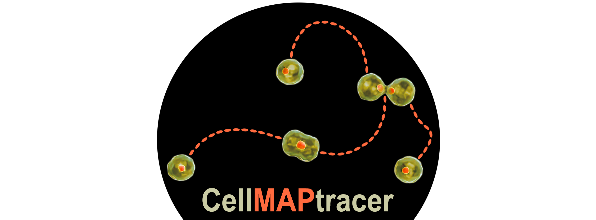

# CellMAPtracer

[](https://zenodo.org/badge/latestdoi/249989991)



## CellMAPtracer: A user-friendly tracking tool for long-term migratory and proliferating cells.  

## Getting Started
To start using the CellMAPtracer program, user have couple of options. The simplest way is to install the program as Matlab App and run it from Matlab within Matlab environment. More advance users who would like to look around code should clone whole repository go to Matlab Code folder and run main fuction (CellTracer_Main). 

## Install Matlab App
1. Download App folder from repository  
2. Open Matlab on any system (Windows, Mac, Linux)  
3. In Matlab go to APPS tab and click 'Install App'  
4. Find  ```CellMAPtracer.mlappinstall```  
5. Click install  
6. Open App from Application list in Matlab  

## Run Cell Tracer from code
Open project in Matlab, run ```CellMAPtracer_Main```
